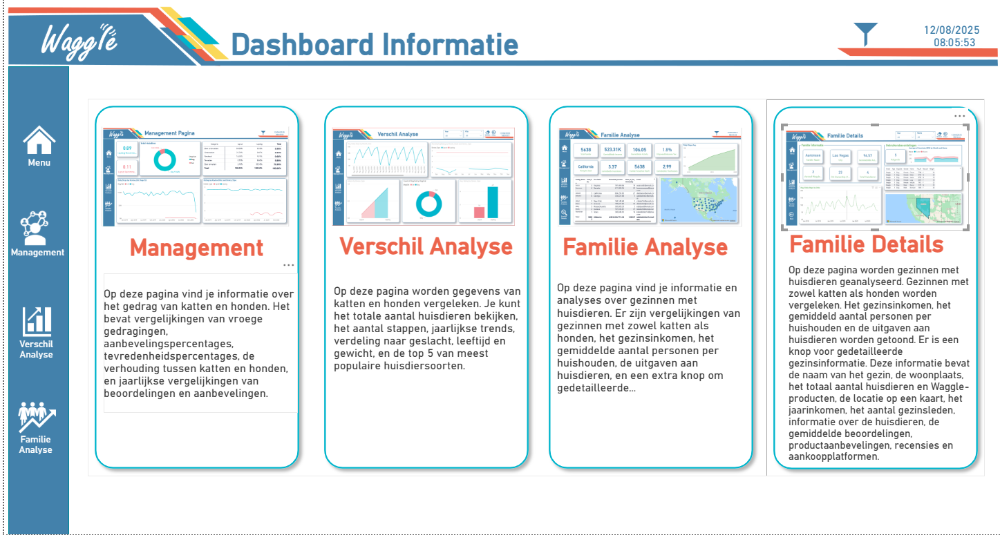
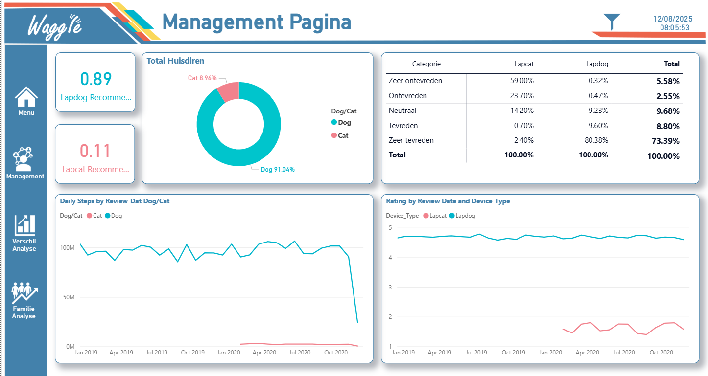

# 📊 Waggle Corp. – Lapcat vs Lapdog Power BI Analysis Project

## 🚀 Project Overview
This project was developed for **Waggle Corp.**, a startup that creates smart devices for pets.  
The goal was to compare **two products**:  
- **Lapdog** 🐶 → A fitness collar for dogs, already successful in the market.  
- **Lapcat** 🐱 → A prototype collar for cats, currently being tested.  

Our task was to build an **interactive Power BI dashboard** to analyze and compare product performance, user satisfaction, and demographic data.  
The results help the **CEO decide** whether **Lapcat** should be launched to the market.

---

## 🎯 Project Goals
- **Answer CEO’s key questions:**
  - Do cats with Lapcat walk more steps daily (similar to dogs with Lapdog)?
  - Are Lapcat owners as satisfied as Lapdog owners?
- **Provide insights for product & marketing teams:**
  - Highlight differences between cats and dogs.
  - Show family demographics of pet owners.
  - Present user reviews and product recommendations.
- **Follow Waggle’s branding guidelines:**
  - Company color palette and logos.
  - Navigation buttons and slicers.
  - Clear, user-friendly design.

---

## 🔧 Methodology & Tools
- **Framework:** Agile–Scrum  
- **Project Management:** Trello, Daily Stand-ups, Sprint reviews  
- **Technology:** Microsoft Power BI  
- **Deliverables:** Interactive dashboards with 3 main pages  

---

## 📑 Dashboard Structure

### 1️⃣ Cat vs Dog Analysis (Management & Verschil Analyse)
- Daily steps comparison (cats vs dogs)  
- Recommendation & satisfaction rates  
- Ratio of cats vs dogs in the dataset  
- Review and recommendation trends over time  

### 2️⃣ General Pet & Family Data (Familie Analyse)
- Total number of cats, dogs, and other animals  
- Average steps per pet (yearly comparison: 2018–2020)  
- Pet population by city (map visualization)  
- Demographic distributions: gender, age, weight  
- Top 5 most popular pet species  
- Household demographics (income, size, location)  

### 3️⃣ Detailed Family Data (Familie Details)
- Household drill-through details:  
  - Family name, location, total pets, Waggle products owned  
  - Income, household size  
  - Reviews, ratings, recommendations  

---

## ⚙️ How It Works
- **Navigation buttons** enable smooth transitions between pages.  
- **Slicers** allow users to filter data interactively.  
- **Company branding** ensures consistency with Waggle’s visual identity.  

---

## 🐾 Key Findings
- Lapcat increased cat activity (steps per day), but results varied by demographics.  
- Lapdog owners reported slightly higher satisfaction rates compared to Lapcat owners.  
- Families with both cats and dogs showed distinct spending patterns and higher Waggle adoption.  

---

## 🛠️ Challenges & Solutions
- **Data Quality Issues** → Applied cleaning and transformation in Power BI.  
- **Visualization Consistency** → Used Waggle’s official color palette and logos.  
- **Navigation Complexity** → Implemented custom bookmarks and slicers.  

---

## 📷 Screenshots

### 📌 Dashboard Overview

### 📌 Verschil Analyse

### 📌 Management Page

### 📌 Familie Analyse

### 📌 Familie Details

### 📌 Data Model

---

## 👥 Team
Developed by **We’RHERE IT Academy Team-1 (Abdullah Mart,A.Özcan Kurşun, Mehmet Gezer, Seneme Mergenci, Sefa Öztürk, Zehra Okay, Sueda Ekiz )** – Waggle Data Analysis Project (23.07.2025).  

---

👉 This project demonstrates how **data-driven insights** can support strategic decisions in product development and marketing.
